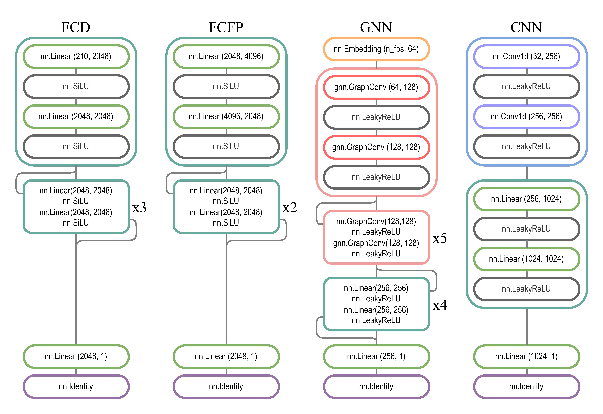

## Finding Potentially Erroneous Entries in METLIN SMRT

This repository supports the preprint **Finding Potentially Erroneous Entries in [METLIN SMRT](https://figshare.com/articles/dataset/The_METLIN_small_molecule_dataset_for_machine_learning-based_retention_time_prediction/8038913)** and contains:

List of SMILES for 1299 potentially erroneous entries is available in `data/output/potentially_erroneous_list.txt`

- Python code in `metlin_filtering/` for:
  - `preprocessing.py` and `utils.py` - preprocessing [METLIN SMRT](https://figshare.com/articles/dataset/The_METLIN_small_molecule_dataset_for_machine_learning-based_retention_time_prediction/8038913)
  - `models.py` - predictive models (architectures and train/eval loops)
  - `training.py` - training and prediction pipeline
- notebooks in `notebooks/` for data analysis:
  - combining the predictions
  - generating statistics, figures and tables
  - drawing molecules and selecting examples
- output data `data/output/` and `reports/figures/`:
    - figures 
    - tables in CSV format
### Model Architectures and Weights

Model weights will be made available later.
